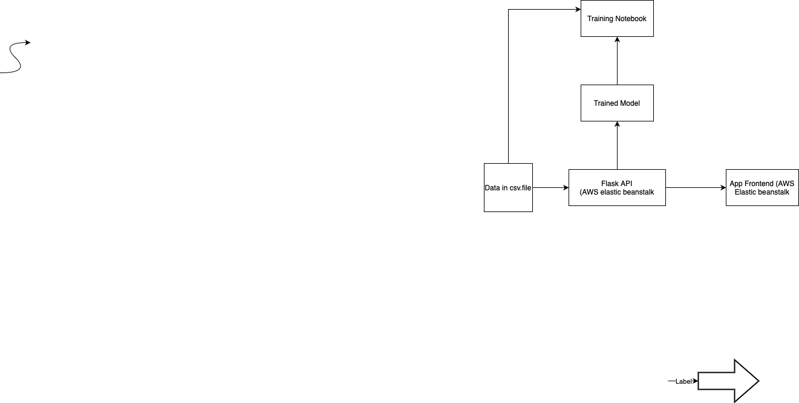

Purpose and Motivation

The purpose of this web application is to predict the house prices in the Perth area. The houses are available for user classification based on features such as price, number of bedrooms, number of bathrooms, land size etc. 
Based on the user classification, the application will suggest average house price using Machine Learning algorithms. The user can able to answer the following questions:

1)What are the factors that contribute towards house prices in Perth?

2)What is the Average house price closer to the Perth CBD?

3)Does the house near to the public transport or school contribute towards the price? 

4)What are the most expensive suburbs according to average house price?

Solution:

Data Source and Cleaning process:

The data is available on Kaggle data open source.The data is cleaned by using pandas.During the cleaning process only na values were dropped.

Technologies involved:
 1) Python Flask server
 2)	HTML, CSS, Bootstrap, JavaScript and Tableau for data visualization and user interactivity
 3)	Machine Learning algorithms to study the data and provide suggestions to the user
 4)	AWS (elastic beanstalk) for deployment

Front-End Development

The front end was created using Bootstrap and W3 school templates. The final front-end was achieved by compiling various sections of those templates. The HTML and CSS were modified to include the appropriate text and graphs.
The graphs were created using the Tableau. . The interactivity was achieved using event listeners, HTML buttons and dropdowns.

Model:

The cleaned data obtained from csv file was read into a jupyter notebook file. The X targets were set to the 7 variables such as Land size, bedrooms, bathrooms etc and the y target set to price.
Using sklearn, the data was split into train and test sets and then fitted to a linear regression to receive the price prediction from the X_ test data.
At this point, the model needed to be referenced in an app.py file to connect the user inputs from a web page to predict the price
The app.py file uses flask to set up two routes for the web page; the first being the loading page which renders the predict.html on load, which has user input boxes for each of the 7 variables in the model, and the second being a prediction route. 
The predict route uses request.form.get for each of the user input values after the predict button is pressed, and then passes the values into a array as float values. Once these inputs are passed into an array, model.predict passes them into the regression, 
and inverse transform (Scikit learn) reverses the log for the Price_log column so the value given to the user outputs in the correct format. Finally, it rounds the value for the predicted price and then returns the value to the user on the same web page under the submit button.

Usage:

To install python requirements/dependencies.

pip install requirements.txt

To run the code locally:

cd app

python app.py

The following indicates that your app is running locally:
* Serving Flask app 'app' (lazy loading)
* Environment: production
WARNING: This is a development server. Do not use it in a production deployment.
Use a production WSGI server instead.
* Debug mode: on
* Running on http://127.0.0.1:5000/ (Press CTRL+C to quit)
* Restarting with stat
* Debugger is active!

Deploy the code to your web hosting service.

To package the app, we will run the following lines of code:
macOS:
zip -r web-app.zip templates static
zip -g web-app.zip app.py prediction.py requirements.txt Procfile
windows:
Note for Windows-only - You will need to install 7z (7-zip) which is a command line tool used for zipping files.
1.	Go to https://www.7-zip.org/ and download the version for your windows PC (usually 64-bit x64)
2.	Run the installer .exe file
3.	Add the path C:\Program Files\7-Zip to your environment variables path
7z a -tzip web-app.zip templates static
7z a -tzip web-app.zip app.py prediction.py requirements.txt Procfile
This will produce a .zip file which contains all the code and library packages required to run the app on AWS Lambda.
For re-use, we've stored the commands in build.sh and build.bat respectively.
You can just build the app by running either
macOS:
. ./build.sh
windows:
build.bat

Deploy app
1.	In the AWS Console, search for "Elastic Beanstalk".
2.	Choose the region closest to you on the top-right e.g. Sydney (ap-southeast-2)
3.	Select "Create Application"
4.	Configure ELB. Note: Unless specified, leave the settings to default.
1.	Provide the application name
2.	Select Platform: "Python"
3.	Select Platform Branch: "Python 3.8 running on 64bit Amazon Linux 2"
4.	In the "Application code" section, select "Upload your code"
	Select "Local file" > "Choose file" and select the .zip file you have built
5.	Select "Configure more options"
1.	Select "Software" > "Edit"
	Provide the environment properties based on your environment variables in _config.template.shor _config.template.bat.
	Select "Save"
2.	Select "Capacity" > "Edit"
	Under "Instance types", ensure that only "t2.micro" is selected.
	Select "Save"
6.	Select "Create app"

